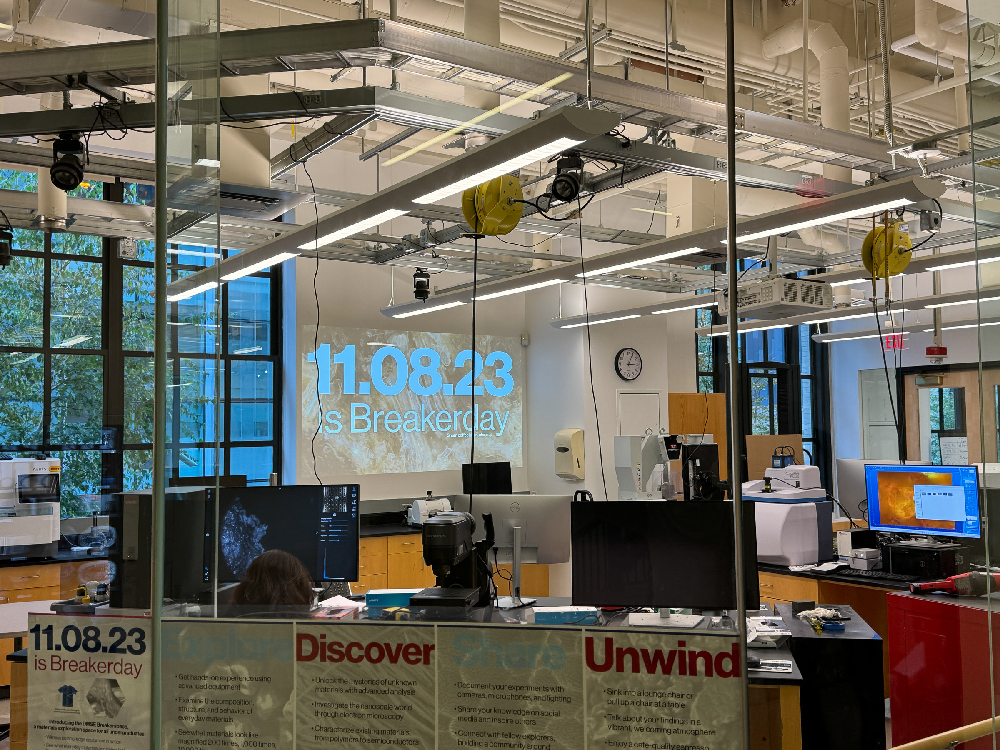

# The DMSE Breakerspace

The DMSE Breakerspace welcomes MIT undergraduates to explore the world of materials through hands-on experiences with powerful desktop materials characterization instruments. More than just a laboratory, it’s a dynamic hub for multidisciplinary learning, encouraging students to pursue their own questions. The Breakerspace also features a lounge for relaxing, socializing, and enjoying espresso — an inclusive space for academic exploration and leisure.

## Training and access:

**Hours:**

The [Breakerspace Lounge](./lounge.html) is open 8 AM to midnight, seven days/week once you request access and agree to lounge policies.

The [Breakerspace Lab](./lab.html) is open 10 AM to 10 PM weekdays, and 12 PM to 5 PM weekends for trained users. Not all hours are staffed, so if you would like to come in during staffed hours when support will be available, please check the calendar below when planning your time in the lab.

**Open to All Undergraduates:** Regardless of your major or interests, the Breakerspace welcomes all MIT undergraduates. Whether you’re a biologist, philosopher, or an economics major, satisfy your curiosity about the materials that make up the world—or just come in, make an espresso, and relax.

**Calendar:** We are using LibCal to help manage registration for instrument training sessions. Please watch the embedded calendar below or visit [breakerspace.libcal.com](https://breakerspace.libcal.com/) to register for training sessions.

<iframe src="https://breakerspace.libcal.com/embed_calendar.php?cal_id=19408&w=750&h=600&dv=agendaWeek&st=0&we=1&hl=prev%2Cnext%20today&hc=title&hr=basicWeek%20agendaDay%2CagendaWeek%2Cmonth&hd=dddd%2C%20MMM%20D%2C%20YYYY&hw=MMMM%20D&hm=MMMM%20YYYY&cd=dddd%20M%2FD&cw=ddd%20M%2FD&cm=ddd&ta=h(%3Amm)a&td=h(%3Amm)a&tm=h(%3Amm)a&fh=10%3A00%3A00&mi=10%3A00%3A00&ma=22%3A00%3A00&ts=00%3A30%3A00&eo=1&el=0&hf=1&sp=1&c1=%23000000&c2=%23000000&c3=%23F3F3F3&c4=%23D0D0D0&c5=%23000000&audience=&cam=&cat=&tar=0&set=1" style="border: 0" width="750" height="600" frameborder="0" scrolling="auto"></iframe>

 
## [Breakerspace Lounge](./lounge.html)

Talk about your findings in a vibrant, welcoming atmosphere. Relax in lounge chairs or pull up a chair at a communal table. Have an espresso or americano from our state-of-the-art coffee equipment—or experiment with different roasting or brewing techniques. [Request lounge access here](https://docs.google.com/forms/d/e/1FAIpQLSdcX0J_sUQmiO0j15IHSrni4rX7LMLaILCjoXQOn4QriWAoHA/viewform?usp=sf_link).
