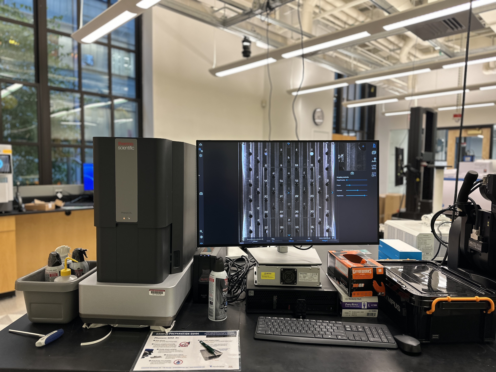

## Instruments

### Thermofisher Phenom XL SEM (scanning electron microscope)

The Phenom XL SEM has a large sample area, BSD and SED detectors, EDS, and is hugely popular.
___

### Thermofisher Phenom Pure SEM 

The Phenom Pure can load a single sample, and BSD and SED detectors but no EDS, and is also popular. We have a temperature-controlled sample holder on order which should arrive during the Spring 2024 semester.
___

### Olympus DSX-1000 Digital Optical Microscope

See images in full color at high magnifications, capture 3D data, and stitch together large images with this easy-to-use digital microscope offering eight observation modes.
___
