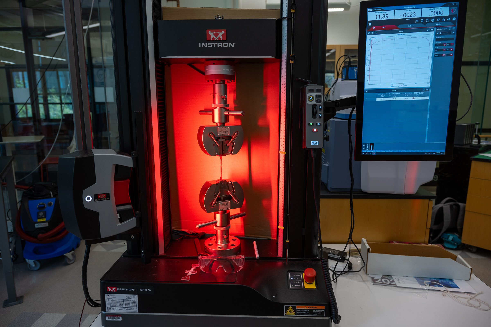
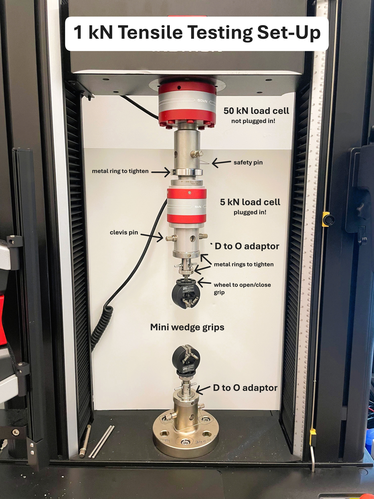
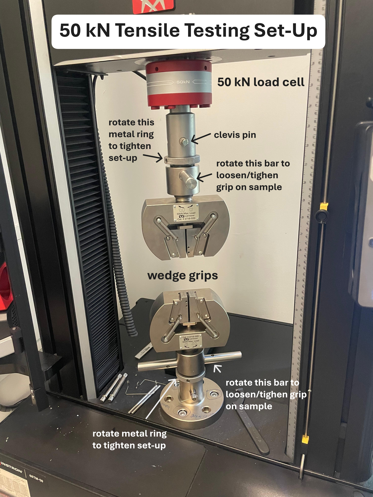
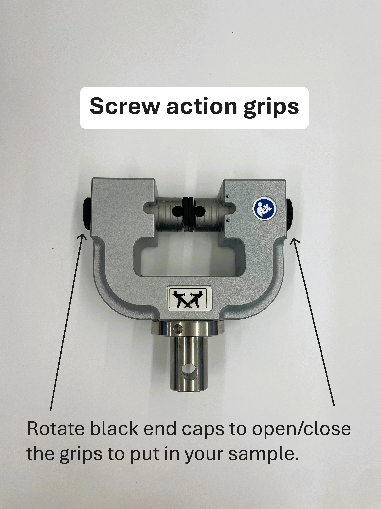
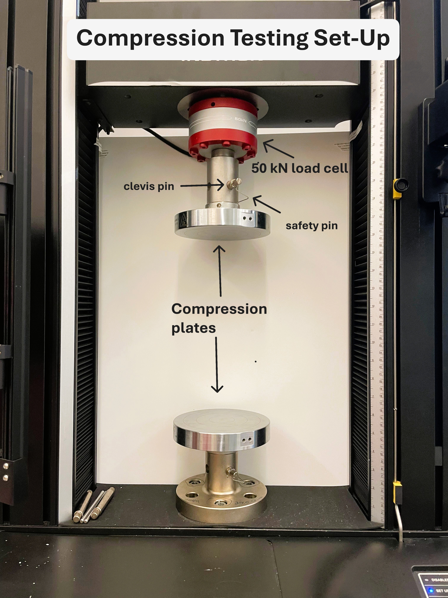
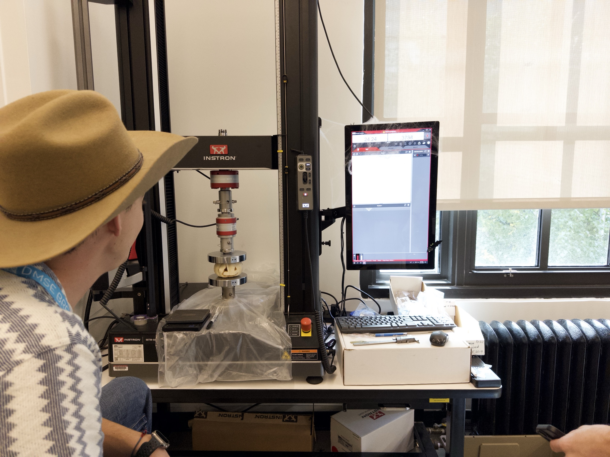
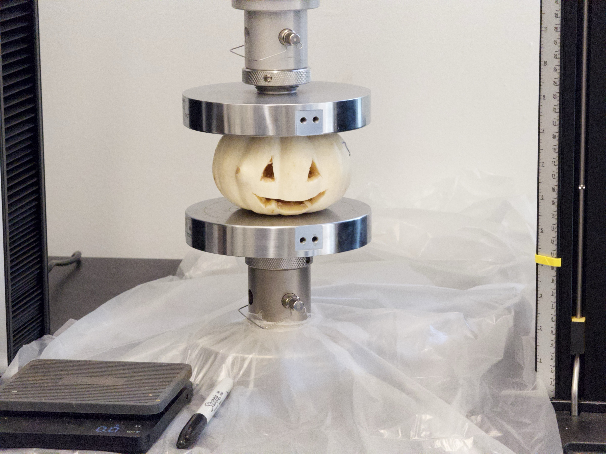
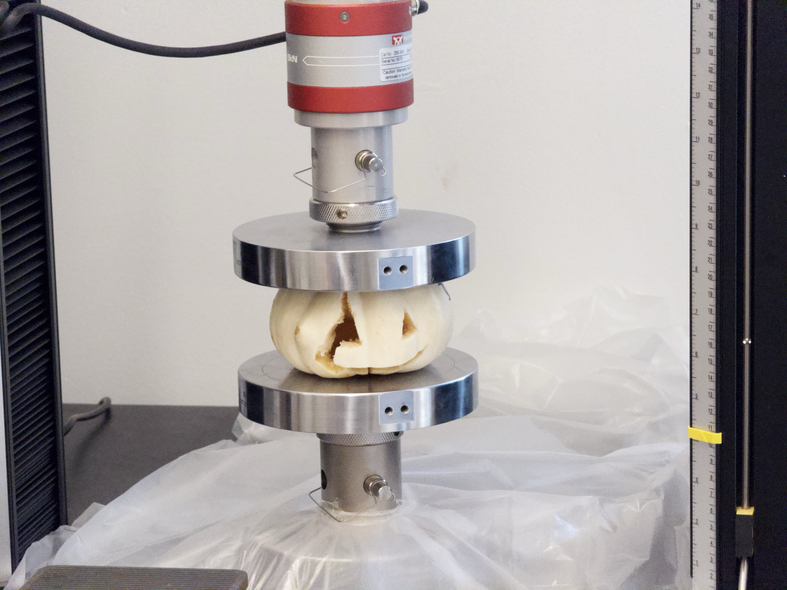

# Instron 68TM-50 Universal Testing System

## Overview

The Instron 68TM-50 is a universal testing machine (UTM): it pulls, pushes, or bends a sample while precisely measuring the force applied and how far the sample moves. From that it produces a force-displacement curve, the basic data behind mechanical properties such as strength, stiffness, and how much a material stretches before it breaks.

The Breakerspace system is equipped with 50 kN and 5 kN load cells and fixtures for tensile (pulling), compression (pushing), and flexure (bending) testing. A video extensometer is available for measuring strain optically.

This page is the operating page for the Instron. It combines the quick reference for trained users, detailed training notes, reservation link, manuals, and exercises.

## Quick Actions {#quick-actions}

<section markdown="1">
### Get started

* [New to the Instron? Register for training](https://breakerspace.libcal.com/calendar?cid=19408&t=w&d=0000-00-00&cal=19408&ct=69558&inc=0)
* [Reserve time on the Instron](https://breakerspace.libcal.com/seat/174792)
* [Operating the Instron now? Follow the standard operating protocol](#sop)
* [Learn the complete operating workflow](#details)
</section>
<section markdown="1">
### Learn and reference

* [Learn what mechanical testing can show you](#science)
* [Choose a mechanical test type](#test-type)
* [Set up a test method in Bluehill](#method)
* [Follow a worked tensile example](#worked-example)
* [Analyze and process your data](#data)
* [View manufacturer manuals](#manuals)
* [Try the practice exercises](#exercises)
</section>

## What This Instrument Shows You {#science}

### The Basic Idea

Every material pushes back when you deform it, up to a point. A universal testing machine measures exactly how hard it pushes back and how far it moves before it yields or breaks. The machine grips a sample and moves one end at a controlled rate while a load cell records the force. The result is a force-displacement curve: the story of how the material responded from the first gentle load all the way to failure.

With the sample's dimensions, that curve can be converted to a stress-strain curve, which is independent of the sample's size and reveals intrinsic properties. The slope of the early part tells you how stiff the material is (its modulus), the highest point relates to its strength, and how far it stretches before breaking tells you whether it is brittle (snaps early) or ductile (stretches a lot first).

The same machine does this in three modes. Tensile testing pulls a sample apart, compression testing squeezes it, and flexure testing bends it across supports. Each answers a different question about how a material behaves under real-world loads.

### What Scientists Use It For

* A materials scientist can measure the strength and stiffness of a new material or compare candidates for a part.
* A mechanical or civil engineer can verify that a component, weld, joint, or adhesive can carry its intended load with a safety margin.
* A product designer can test whether a 3D-printed bracket, a packaging clip, or a plastic housing will survive normal use.
* A biomedical researcher can measure the mechanical properties of scaffolds, gels, or soft materials that must match living tissue.
* A student can settle a hands-on question: which 3D-print infill is actually strongest, how much weight fishing line really holds, or how a glue joint compares to the material around it.
* At a supervised outreach event, the Breakerspace has even crushed carved pumpkins to make force, cracking, and collapse visible (see [staff-guided event example](#pumpkin)).

### What To Look For In The Results

Start with the overall shape of the curve. A steep initial rise means a stiff material; a gentle one means a compliant, stretchy material. The height of the curve shows how much force the sample carried, and where it drops shows where the sample failed.

Look at how the sample fails. A curve that rises then suddenly drops to zero suggests brittle fracture (a clean snap); one that rises, levels off, and stretches a long way before dropping suggests ductile behavior. The failure point on the curve should match what you saw happen to the sample.

Finally, sanity-check against the setup. A curve with a soft, curved "toe" at the start often means slack or slipping grips rather than real material behavior, and repeated breaks right at the grip face usually point to a gripping problem rather than the true strength (see [common failure modes](#failures)).

### What This Instrument Cannot Tell You

* It measures mechanical response, not chemistry or structure. It tells you how strong or stiff something is, not what it is made of.
* Results depend heavily on sample geometry and gripping. A poorly prepared or misaligned sample gives a misleading curve, so preparation matters as much as the test.
* A single test is not the whole story. Materials vary, so meaningful conclusions usually need several samples, not one.
* It applies controlled, usually slow loading. It does not directly report impact resistance, fatigue over many cycles, or long-term creep unless a test is specifically designed for those.
* It has force and size limits. Samples must fit the fixtures and stay within the load-cell range; oversized or extremely strong samples may not be testable here.

## Standard Operating Protocol {#sop}

Mechanical testing involves stored energy, heavy fixtures, moving crossheads, and samples that can break suddenly. Keep the enclosure area clear, know where the emergency stop is before you start a test, and never place hands between the grips while the machine is enabled. Some tasks and heavy tooling may call for two people or additional precautions; when in doubt, ask staff and see the [Safety and Lab Use](../safety.html) page.

### Instrument Startup {#startup}

* Log on to the instrument workstation using your MIT Kerberos.
* Open the Bluehill Universal software.
* If the event log opens, you can close it.

### Operation {#operation}

* Set up the mechanical test appropriate for your sample (see [detailed operating instructions](#details) for each test type).
* Confirm the correct load cell connector (5 kN or 50 kN) is inserted and plugged in.
* Select or create the appropriate test method in Bluehill (see [setting up a test method](#method)).
* Enter the required specimen information and set travel limits so the crosshead and fixtures cannot collide with anything (see [set travel and transducer limits](#limits)).
* Position and load the sample, zero displacement, and balance the force reading.
* On the testing page, press **unlock** then **start** on the [hand controller](../assets/img/tutorials/instron/ANNOTATED_hand_controller_in_set_up.JPG) in quick succession. The ready-to-test window lasts about two seconds.
* Perform the mechanical characterization appropriate for the sample and method. To stop the test, press **stop** on the [hand controller](../assets/img/tutorials/instron/ANNOTATED_hand_controller_in_set_up.JPG); use the red emergency [stop button](../assets/img/tutorials/instron/ANNOTATED_emergency_indicator.JPG) for an emergency.
* When every specimen is done, select **Finish sample** to save the sample.

### Instrument Shutdown {#shutdown}

* Save your data and export it, keeping a copy on your own storage (see [saving and exporting results](#saving)).
* Remove your sample and any fragments. If a sample did not break, relieve the load before opening the grips.
* Disassemble your test setup and return all parts to the boxes they came from.
* Wipe up any debris.
* Close the Bluehill Universal software and log off the computer.
* Confirm the Instron is in disabled mode.

## Compatible Materials And Sample Prep {#materials}

* All materials must be non-hazardous and safe to handle in the Breakerspace.
* Avoid samples that may shatter dangerously, such as glass.
* Avoid wet samples or anything that would foul the machine.
* Some samples need cutting to fit the grips. The Breakerspace has scissors, razor blades, and a sectioning saw available.
* Check whether an [ASTM standard](https://www.astm.org/) exists for your test; standard sample geometries give more comparable, reliable results.

<em>If you have any questions about whether a material is appropriate to characterize in the Breakerspace, please ask before bringing it to the lab.</em>

## Test Type Selection {#test-type}

| Test | What it measures | Typical setup |
| --- | --- | --- |
| Tensile (small/weak samples) | Strength and stretch under pulling | Mini wedge grips, max load 1 kN |
| Tensile (intermediate loads) | Strength and stretch under pulling | 5 kN tensile grips on the 5 kN load cell, max load 5 kN |
| Tensile (standard) | Strength and stretch under pulling | Wedge grips, up to 50 kN |
| Compression | Response under squeezing | Compression platens on the 50 kN head |
| Flexure | Bending strength and stiffness | Flexure fixture on the 5 kN head |

Match the load cell to the sample: use the 5 kN cell for smaller, weaker samples and the 50 kN cell for stronger ones. If you are not sure which test or fixture fits your sample, ask staff.

## Detailed Operating Instructions {#details}

The sections above are a quick reference for trained users. The sections below are a training guide for new users, with the practical details and diagrams that are easiest to follow at the instrument.

A complete test has two halves. First you build the **load string** — the load cell, adapters, grips or fixtures, and your sample — which is the hardware half covered under [load cell](#load-cell) through [video extensometer](#extensometer). Then you set up and run the test in **Bluehill Universal**, covered under [Bluehill orientation](#bluehill) through [saving and exporting](#saving). Names in **bold** are the on-screen buttons and screens in Bluehill, or the labeled controls on the frame and handset.

Page references point into Instron's [6800 operator guide](#manuals) and the fixture guides linked there.

### Load Cell {#load-cell}

* Choose the load cell for your sample: 50 kN for stronger samples, or 5 kN for smaller, weaker ones.
* The 50 kN cell stays attached to the machine.
* To install the 5 kN cell, insert its thin end into the bottom of the 50 kN cell, push a clevis pin through both, and attach the safety clip. Rotate the metal ring clockwise until tight.
* When using the 5 kN cell, plug its connector into the [correct port](../assets/img/tutorials/instron/ANNOTATED_connection_port_instron.JPG). Push in the [side clips](../assets/img/tutorials/instron/ANNOTATED_load_cell_connector.JPG) as you insert it; this connector can take several tries.

Two rules matter more than the mechanics. The load cell connected to the designated force-transducer port is the one Bluehill reads. If the 5 kN cell is installed but not connected, Bluehill continues reading the 50 kN cell. A correctly calibrated 50 kN cell should not systematically change the force value, but it provides poorer resolution for a low-force test; connect the intended cell and verify the active transducer before testing. And the expected test load must not exceed the rating of *any* component in the load string — frame, load cell, adapters, or grips. *(6800 operator guide, load string and load-cell selection, pp. 79–81; installation, pp. 82–99.)*

If the frame has been off, let the load cell warm up for about 20 minutes before you rely on the readings. *(6800 operator guide, p. 113, step 9.)*

### Attaching Fixtures {#fixtures}

Most parts attach the same way: align the internal holes, insert a clevis pin, add a safety clip, and rotate the metal ring to secure. Use a [spanner wrench](../assets/img/tutorials/instron/spanner_wrench.jpeg) to tighten the metal rings if needed.

Before installing grips, confirm the frame is in **DISABLED** mode (the white indicator lit), the crosshead is stationary, and the mating surfaces are clean. Install the upper grip into the load-cell adapter's clevis socket, then the lower grip onto the base adapter. *(6800 operator guide, install grips, pp. 105–106; typical grip installation, Figure 25, p. 107.)*

Do not loosen a lock nut by force. The load string is normally left **preloaded**, which removes backlash that would otherwise distort results at high loads, and preloaded lock nuts are deliberately too tight to turn by hand. Unloading and re-preloading the load string uses a dedicated `Preload Grips` method and is a staff task — ask rather than improvising with a wrench. *(6800 operator guide, preload, pp. 107–108; unload, p. 109.)*

### Setup Diagrams {#setup-diagrams}

Each test type uses a different fixture arrangement. The annotated setups below are current reference photos.

<figure class="page-figure" style="max-width:32rem;">
  
  <figcaption>Tensile testing with mini wedge grips (max load 1 kN).</figcaption>
</figure>

<figure class="page-figure" style="max-width:32rem;">
  
  <figcaption>Tensile testing with wedge grips (max load 50 kN).</figcaption>
</figure>

<figure class="page-figure" style="max-width:32rem;">
  
  <figcaption>Anatomy of the 50 kN wedge grip.</figcaption>
</figure>

<figure class="page-figure" style="max-width:32rem;">
  
  <figcaption>Screw action grips: rotate the black end caps to open and close the jaw faces onto your sample.</figcaption>
</figure>

<figure class="page-figure" style="max-width:32rem;">
  
  <figcaption>Compression testing with the 50 kN head.</figcaption>
</figure>

<figure class="page-figure" style="max-width:32rem;">
  
  <figcaption>Flexure testing with the 5 kN head.</figcaption>
</figure>

### Loading A Sample Into The Grips {#loading}

How you seat the sample affects the result as much as any software setting. Most beginner curves that look wrong are gripping problems, not material behavior.

* **Grip enough of the sample.** Aim for at least 75% of the available jaw-face length in contact, and position the sample so it engages the full length of the faces. Too little grip area is the usual cause of slipping. *(6800 operator guide, p. 105.)*
* **Center and align it.** Install the sample in the center of the jaw faces, in line with the load path. Misalignment adds bending to what should be pure tension and can break grip components. Use the specimen centering device if the grip has one. *(Wedge grips reference manual, installing a specimen, pp. 35–36 and Figure 10, p. 37.)*
* **Tighten by hand, evenly.** For wedge grips, hand-tighten the lower grip's control nut until the faces engage, then the upper. Do not over-tighten: excessive force damages the grip and preloads your sample before the test starts. *(Wedge grips reference manual, p. 36, steps 5–6.)*
* **Keep fingers out of the jaw gap.** Treat the space between the faces as off limits whenever the frame is enabled.
* **Choose faces to match the sample.** Flat faces for flat samples, vee-shaped for round ones. If samples keep breaking right at the jaw face, the serrations may be biting too hard — ask staff about faces with finer serrations, or soften the bite with masking tape. *(6800 operator guide, p. 105.)*

Do not release the grips while the sample is still under load. If the sample did not break, jog the crosshead to relieve the force first. *(6800 operator guide, p. 114, step 20; wedge grips reference manual, removing a specimen, pp. 37–38.)*

### Video Extensometer {#extensometer}

The video extensometer measures strain optically by tracking marks on the sample. It is the accurate way to get strain, because crosshead displacement includes machine and grip compliance as well as the sample's own stretch.

* Press the [on](../assets/img/tutorials/instron/ANNOTATED_video_extensometer.JPG) button; confirm the red light appears.
* Draw dots on your sample a set distance apart using the [guide and paint markers](../assets/img/tutorials/instron/ANNOTATED_drawing_dots.JPG).
* Load your sample.
* Following the software diagram below, click 1, then 2. In field 3, click and hold over an area that includes your dots; they should be detected automatically. Click close and proceed with your test.

Marking well matters, because a mark the camera loses mid-test costs you the strain data:

* Dots should be **2–4 mm across** (the supplied jigs make 3 mm dots at standard gauge lengths). Keep the pen upright, run it around the edge of the hole twice, then fill the center. *(Video extensometer operator guide, applying ink dots, p. 52.)*
* **White usually reads best**, even on samples that look white to your eye, because the camera uses polarized light. Black is the fallback; avoid silver, which reads as black. *(Video extensometer operator guide, p. 51.)*
* Make sure the sample is clean and grease-free, let the ink dry, and check that the dots are round and opaque before testing. Test soon after marking. *(Video extensometer operator guide, pp. 52–53.)*
* If the dots smudge, bleed, or wick into the surface, or the sample changes color or stretches so far that the marks leave the field of view, the extensometer can lose them. The troubleshooting list on p. 53 maps each symptom to its cause.

<figure class="page-figure" style="max-width:28rem;">
  
  <figcaption>Video extensometer software: click 1, then 2, then select region 3 around your dots.</figcaption>
</figure>

Setting the extensometer up inside a method is a staff-supported task the first time. In Bluehill it appears as a strain measurement on **Strain 1**, is chosen as the primary strain source under **Test Control**, and should have auto-balance enabled before the test. *(Video extensometer operator guide, using Bluehill Universal, p. 78.)*

### Bluehill Orientation And Operating Modes {#bluehill}

Bluehill Universal opens on a home screen with three routes. **Test** starts or continues a sample. **Method** creates or edits the test recipe. **Admin** configures the system and is staff-only.

<figure class="page-figure" style="max-width:22rem;">
  
  <figcaption>The Bluehill home screen. Live displacement and force are always shown across the top, and the status bar runs along the bottom.</figcaption>
</figure>

Before anything else, learn the four **operating modes**, because they explain most "the machine won't start" confusion. The mode shows both as a colored border in Bluehill and as a lit LED on the [indicator panel](../assets/img/tutorials/instron/ANNOTATED_emergency_indicator.JPG):

| Mode | Indicator | What it means |
| --- | --- | --- |
| **DISABLED** | White | Default at startup. The crosshead cannot move. Press **unlock** to leave this mode. |
| **SET UP** | Blue | Restricted state for setting up. You can jog at reduced speed (600 mm/min or less). This is where you spend most of your time. |
| **CAUTION** | Yellow | Unrestricted and ready to test. **Times out back to SET UP after about 2 seconds** if you do not start the test. |
| **TESTING** | Red | A test is running, or the crosshead is returning to its start position. |

The path to running a test is therefore **DISABLED → SET UP → CAUTION → TESTING**, driven by the [hand controller](../assets/img/tutorials/instron/ANNOTATED_hand_controller_in_set_up.JPG): press **unlock** to go from DISABLED to SET UP, press **unlock** again to enter CAUTION, then press **start** *within about two seconds*. That two-second window is why the handout tells you to press unlock and start in quick succession — if you pause to think between them, the frame quietly drops back to SET UP and the test never begins. *(6800 operator guide, operating modes, pp. 62–64; move between modes, Table 5, pp. 65–66.)*

Two other mode behaviors are worth knowing. Holding **stop** for two seconds disables the frame deliberately. And holding **unlock** while pressing a **jog** button jogs at high speed, which is useful when bringing the crosshead into position but bypasses the reduced-speed protection — keep the test area clear. *(6800 operator guide, jog at high speed, pp. 68–69.)*

### Setting Up A Test Method {#method}

A **method** is the recipe for the test: what the crosshead does, what gets measured, what the operator is asked to type in, and what the software calculates. A **sample** is one run of that method over a group of specimens. Methods are reused, so most sessions start by picking an existing one rather than building from scratch.

From the home screen, click **Method** to create or edit one. New methods start from a template, and the template you choose sets the basic test type:

<figure class="page-figure">
  
  <figcaption>The Method screen. Templates on the left set the test type; the panel to the right lists application-specific methods, filtered here to metals standards.</figcaption>
</figure>

* **Tension method** pulls the sample to failure; **Compression method** squeezes it; **Flexure method** bends it on 3- or 4-point supports. Match the template to the fixtures you actually installed.
* The **Application type** dropdown filters the list to standards-based methods — for example the ASTM metals methods shown above. If your test should follow a published standard, starting from that standard's method is better than reproducing its parameters by hand.
* Set the **rate** at which the crosshead moves, and the **end-of-test condition** that stops the run. A sudden drop in force is the usual condition for a test to failure; the 3.000 coffee-bean teaching method, for instance, stops on a 30% force drop, which is what makes it end the moment the bean cracks.
* Add the **operator inputs** you want to be prompted for. Sample dimensions belong here: with width and thickness (or diameter) entered per specimen, the software can convert force-displacement into stress-strain and calculate modulus, strength, and strain to failure. Without them you only get force and displacement.
* Save the method under a descriptive name of your own. Do not overwrite a shared or course method — other users and classes depend on them.

If you only need a quick force-displacement curve and no calculated properties, **Run a QuickTest** from the Test screen performs a test with a basic set of parameters and no method authoring. It is the fastest way to get a first curve, and a reasonable choice for a training run.

For anything beyond these basics — custom calculations, multi-stage control, report layouts — Bluehill's own Help and Reference, opened with the **?** icon in the top right, is the authoritative source and is more current than any summary here. *(6800 operator guide, create a new sample, p. 118.)*

### Set Travel And Transducer Limits {#limits}

This is the step most likely to damage something if skipped, and it comes *before* you start the test.

**Crosshead travel limits** are physical stops — two adjustable blocks on the limit rod inside the column, tightened by hand. They stop the crosshead independently of the software, so they still protect you if a method is wrong. Set them after the crosshead is at its starting position but before the test:

* For **tension**, set the upper stop just above the maximum travel you expect, and the lower stop just below the starting position.
* For **compression**, set the upper stop just above the starting point, and the lower stop just below the maximum downward travel you expect.
* Allow about **3 mm of extra travel** past where you want motion to stop, because there is a short delay between the actuator striking the stop and the switches reacting.
* Position the stops so the upper and lower grips or platens cannot collide with each other.

*(6800 operator guide, crosshead limit stops, pp. 123–124 and Figure 26, p. 124.)*

Do not use the limit stops as a routine end-of-test condition. They are a safety backstop, and repeatedly driving into them wears them until they may fail to stop the crosshead. End tests from the software instead. *(6800 operator guide, p. 125.)*

**Transducer limits** are the software's own ceilings on force, displacement, and strain, set per transducer. Setting a force limit near the rating of the weakest load-string component is what protects your load cell from an unexpectedly strong sample. If a limit trips mid-test, the test stops; jog the crosshead in the direction that removes the condition to reset it. *(6800 operator guide, set the limits for a transducer, p. 125; troubleshooting, p. 129.)*

Bluehill prompts you to confirm travel limits as part of starting a test. Treat that prompt as a real check that the stops are physically set where you intend, not a dialog to click through.

### Running The Test {#running}

With the load string assembled, the sample loaded, the method selected, and limits set, the run itself is short.

<figure class="page-figure">
  
  <figcaption>The Test screen. Start from a recent method, <strong>Browse methods</strong>, or <strong>Run a QuickTest</strong>. The recent-methods list is redacted here because it shows real user files.</figcaption>
</figure>

1. **Start the sample.** From the home screen click **Test**, then choose your method — from the recent list, via **Browse methods**, or **Run a QuickTest**. Bluehill creates a sample and moves to the Test workspace.
2. **Confirm the load cell.** Check that the connected cell (5 kN or 50 kN) is the one you intend, and that the live force readout responds sensibly when you touch the load string.
3. **Enter sample dimensions.** Fill in the operator inputs for this specimen. Measure each specimen individually rather than reusing one set of numbers.
4. **Set travel limits when prompted**, as described under [limits](#limits).
5. **Position the crosshead and zero displacement.** Jog until the sample is just taken up — for a compression test, roughly a centimeter above the sample — then press **zero displacement** on the handset. The button illumination changes from white to green. This makes the current position the origin for the measurement. *(6800 operator guide, set the zero displacement point, p. 123.)*
6. **Balance the force reading.** With the sample installed but unloaded, balance the force transducer so the run starts from zero and does not carry a standing offset. *(6800 operator guide, balance a transducer configuration, pp. 125–126.)*
7. **Check the area is clear**, and that nobody else is reaching into the frame. Only one person operates the machine at a time. *(6800 operator guide, p. 112.)*
8. **Run it.** Press **unlock** then **start** on the [hand controller](../assets/img/tutorials/instron/ANNOTATED_hand_controller_in_set_up.JPG) in quick succession — remember the roughly two-second CAUTION window. The indicator goes red and the curve builds live on screen.
9. **Watch the test, not the screen only.** Know before you start where the [stop button](../assets/img/tutorials/instron/ANNOTATED_emergency_indicator.JPG) is. Stop early with **stop** on the hand controller; in a genuine emergency push the red emergency stop, which halts motion and disables the frame.
10. **After it ends**, the frame returns to SET UP. Remove the sample and any fragments. If the sample did not break, jog to relieve the load before opening the grips. To bring the crosshead back to its start position, press **unlock** then **return**.
11. **For the next specimen**, repeat from step 3. When the whole group is done, select **Finish sample** on the Test tab to close and save the sample.

*(6800 operator guide, testing a sample, pp. 111–114 — the procedure for a system with no interlock, which matches this machine.)*

Wear safety glasses for mechanical testing, and use a shield or screen when testing anything brittle that could throw fragments. See [Safety and Lab Use](../safety.html) for the lab-wide rules.

### Saving And Exporting Results {#saving}

* A sample is only written to disk when you **finish the sample** or press **Save** on the Test tab. Do not close Bluehill on an unsaved sample. *(6800 operator guide, p. 119.)*
* Export both the **raw data** (force, displacement, time, and strain if you used the extensometer) and any **calculated results** or report. Raw data lets you re-plot and re-analyze later; a report alone does not.
* Save a copy to **your own storage** before you leave. The workstation is a shared lab computer, not a backup, and files there may be cleaned up.
* Use a consistent, descriptive name — a convention such as `Lastname_sampleID_YYYYMMDD` keeps exports organized and matches the other instruments in the lab.
* Note your test conditions alongside the data: load cell, method, rate, sample dimensions, and which specimen is which. A curve without its dimensions cannot be converted to stress-strain afterward.

### Worked Example: A Tensile Test From Start To Result {#worked-example}

This walkthrough ties the sections above together for the most common test on this machine: pulling a small polymer or 3D-printed coupon to failure.

1. **Plan the load.** A coupon 10 mm wide and 3 mm thick, in a material of roughly 40 MPa tensile strength, needs about 40 MPa × 30 mm² ≈ 1.2 kN to break. That is comfortably inside the 5 kN cell and only about 2% of the 50 kN cell's range, so choose the **5 kN load cell** for better resolution. *(6800 operator guide, load-cell selection worked calculation, p. 80.)*
2. **Build the load string.** Install the 5 kN cell below the 50 kN cell with a clevis pin and safety clip, and **plug its connector in**. Install the distinct **5 kN tensile grips** above and below; do not use the 1 kN mini wedge grips for this example. Confirm the frame reads **DISABLED** while you work.
3. **Mark the sample, if measuring strain.** Using the jig, apply two 3 mm white dots at a known gauge length. Let the ink dry and check the dots are round and opaque.
4. **Load the coupon.** Open the jaw faces, insert the coupon so it engages the full face length and at least 75% of it, center it in line with the load path, and hand-tighten the lower then upper control nut. Keep fingers clear of the jaw gap.
5. **Select the method.** Click **Test**, then a tension method — either a saved one with your dimension inputs and a force-drop end condition, or **Run a QuickTest** for a first curve with no calculated properties.
6. **Enter dimensions.** Type this specimen's measured width (10 mm) and thickness (3 mm) so the software can produce stress-strain rather than force-displacement alone.
7. **Set limits.** Set the upper travel stop just above the extension you expect plus about 3 mm, the lower stop just below the starting position, and the force limit no higher than the 5 kN rating of the grips and load cell (or lower if another component in the load string has a lower rating).
8. **Zero and balance.** Jog until the coupon is just taken up with no slack, press **zero displacement** until it lights green, then balance the force reading to zero.
9. **Run it.** Confirm the area is clear, press **unlock** then **start** in quick succession, and watch the sample as the curve builds.
10. **Read the curve as it happens.** Force rises steeply and nearly straight while the coupon stretches elastically — that slope is stiffness. The curve then bends over as the material yields, reaches a peak, and drops when the coupon breaks. The moment you hear or see the break should line up with the drop on screen.
11. **Finish and export.** Remove both pieces, press **unlock** then **return**, and repeat for the remaining specimens — at least three, because single results are not meaningful. Select **Finish sample**, export the raw data and results, and copy them to your own storage.
12. **Sanity-check before you trust it.** A soft, curved toe at the start of the curve usually means slack or slipping grips rather than real compliance, so re-seat and re-run if you see one. Breaks repeatedly at the jaw face point to a gripping problem, not the material's true strength. Compare your peak stress against a published value for the material: agreement within a modest margin suggests the setup was sound, while a result several times off usually means a dimension or unit-entry error, grip slip, misalignment, or a calculation problem. Using a higher-capacity load cell mainly reduces resolution at low force; it should not multiply a correctly calibrated force reading. See [common failure modes](#failures).

An annotated example curve marking the stiff region, peak, and failure point is on the staff media checklist and will be added here once a reviewed example is available.

## Data Processing And Analysis {#data}

* By default the software outputs a force-versus-displacement graph.
* When you create a method, you can enter your sample dimensions and have the software automatically calculate properties such as modulus, strength, and strain, converting force-displacement into stress-strain.
* Save both the raw test data and any calculated results, and keep a copy on your own storage. See [saving and exporting results](#saving) for the workflow.
* Because materials vary, run several samples and compare rather than relying on a single test.

### Reading A Force-Displacement Curve {#reading-curves}

Work through a curve in the same order every time:

1. **The initial slope** is the stiff, nearly straight region where the sample deforms elastically. Its steepness reflects stiffness — converted to stress-strain, its slope is the modulus. Note that crosshead displacement includes stretch in the grips and frame, so a modulus taken from displacement alone reads low; use the [video extensometer](#extensometer) when the modulus matters.
2. **The departure from straight** is where the material starts to deform permanently, giving the yield point.
3. **The peak** is the highest force the sample carried. Divided by the original cross-sectional area, it gives the ultimate strength.
4. **The drop** is failure. A near-vertical drop suggests brittle fracture; a long, gradual decline after the peak suggests ductile behavior with drawing or necking.
5. **The area under the curve** relates to the energy absorbed before failure — the practical difference between a material that is merely strong and one that is tough.

Compare the shape against what you physically saw happen. If the curve says the sample failed gradually but you watched it snap, or the failure point on the curve does not match the moment of the break, suspect the setup before believing the data.

A curve that starts with a soft, curved "toe" before stiffening is usually reporting slack or grip slip rather than material compliance. Some analyses apply a toe correction by extrapolating the straight region back to zero force; it is better to fix the gripping and re-run.

## Common Failure Modes {#failures}

| Symptom | Likely cause | What to try |
| --- | --- | --- |
| Video extensometer does not work | It is not actually on | Confirm the red light is lit; press the [on](../assets/img/tutorials/instron/ANNOTATED_video_extensometer.JPG) button again if not. |
| Extensometer loses the dots mid-test | Marks too small, low contrast, smudged, or stretched out of view | Use 2-4 mm dots in a contrasting color (white usually reads best), let the ink dry, and check they are round and opaque before testing. See [video extensometer](#extensometer). |
| Load cell connector will not seat | Side clips not pushed in | Push in the [side clips](../assets/img/tutorials/instron/ANNOTATED_load_cell_connector.JPG) while inserting; it can take several tries. |
| Low-force readings are noisy or lack the expected resolution | The higher-capacity 50 kN cell is active instead of the 5 kN cell | Confirm the intended load cell is connected to the [correct port](../assets/img/tutorials/instron/ANNOTATED_connection_port_instron.JPG) and verify the active transducer in Bluehill before testing. |
| Test will not start even though the frame is enabled | The two-second ready-to-test window expired | Press **unlock** then **start** in quick succession. See [operating modes](#bluehill). |
| Software will not start a test, or the hand controller is unresponsive; disabled light is blinking | Emergency stop is engaged | Hold the red emergency button and turn it clockwise about 15 degrees until it pops up, then press **unlock**. |
| Software will not start a test; disabled light is lit but not blinking | Machine is in disabled mode | Press [unlock](../assets/img/tutorials/instron/ANNOTATED_hand_controller_when_disabled.JPG) on the hand controller to enter setup mode. |
| Test stops early with no failure, or the crosshead will not move | A travel limit or software transducer limit tripped | Jog the crosshead in the direction that removes the condition. See [set travel and transducer limits](#limits). |
| Force-displacement curve looks wrong | Loose attachments | With the frame **DISABLED**, the crosshead stationary, and the load fully relieved, check each attachment by hand; nothing should move. Never touch or adjust the load string while the frame is enabled or loaded. |
| Curve starts with a soft, curved toe | Slack in the setup or grips slipping before they bite | Take up the slack before zeroing displacement, seat the sample deeper in the jaw faces, and re-run. See [loading a sample](#loading). |
| Sample keeps breaking right at the grip face | Grip pressure, grip type, or serrations biting too hard | Loosen the grips slightly, try a different grip type, or ask staff about finer serrations or masking tape to soften the bite. |
| Readings drift or will not settle at zero | Load cell not warmed up, or force not balanced | Allow about 20 minutes of warm-up after the frame is switched on, then balance the force reading with no load applied. |

## Manufacturer Manuals {#manuals}

The manual that matters most for operation is the **6800 Dual Column Table Model operator guide**, which covers the frame, handset, operating modes, load string, limits, and the full test procedure. It is published by Instron, and the page references throughout this page point into it.

* [6800 Dual Column Table Model operator guide](https://www.instron.com/wp-content/uploads/2024/07/6800-dual-column-table-model-operator-guide-7.pdf) — the primary reference. Risk reduction and safe use (ch. 2, pp. 25–33); function of controls, including the handset, indicator panel, and operating modes (ch. 4, pp. 53–78); assembling the load string, load-cell selection and installation, grips, and preload (ch. 5, pp. 79–109); testing specimens, zero displacement, limit stops, stopping a test, and shutdown (ch. 6, pp. 111–129); maintenance and load-cell troubleshooting (ch. 7, pp. 131–139).

Fixture and accessory guides, for grip-specific and fixture-specific detail:

* [5 kN, 10 kN, and 50 kN wedge grips reference manual](https://www.dropbox.com/scl/fi/3iaxhdxfo8pwxtj8t7m2i/5kn-10knand50kn-wedge-grips-reference-manual.pdf?rlkey=rjm1t839hzfv8yzly7mihjh2n&st=m76u4b4n&dl=0) — installing and removing a specimen (ch. 4, pp. 35–38), including specimen placement (Figure 10, p. 37) and the 35 kN / 55 kN load cautions (p. 35). Jaw faces and grip anatomy are in ch. 1–2 (pp. 11–21).
* [Video extensometer operator guide](https://www.dropbox.com/scl/fi/rgb05cbfo30mf80uwskek/video-extensometer-ave2-2663-901-and-sve2-2663-902-operator-guide.pdf?rlkey=qfhgbcfwtsl57fdbellgg206w&st=h7hcnio8&dl=0) — marking specimens, ink-dot sizing, and mark-color choice (ch. 4, pp. 51–54); Bluehill Universal setup (ch. 6, pp. 59–65); running tests (ch. 9, pp. 77–79).
* [Miniature grips for low-force testing operator guide](https://www.dropbox.com/scl/fi/zprr8ua5ma26lzqb31czo/2711-006-miniature-grips-for-low-force-testing-operators-guide.pdf?rlkey=a26sizgotrx3beaa1iujvgp0r&st=njxjs6bs&dl=0) — for the mini wedge grips. Note the capacity limit: the 016 grip is rated to 1 kN.
* [Screw action grips reference manual](https://www.dropbox.com/scl/fi/nf5pnttlapjawi8cm94ms/2710-11x-screw-action-grips-reference-manual.pdf?rlkey=7q1aeazj97xoshgy7n29297ed&st=ozgbhy08&dl=0) — installing and removing jaw faces (ch. 3).
* [5 kN flexure fixture reference manual](https://www.dropbox.com/scl/fi/59aeqcu8o9b7isv7gu93a/5kn-flexure-fixture-reference-manual.pdf?rlkey=f4wtjfybmg86kruq1hcp32nms&st=1u3dpdjr&dl=0) — installing the fixture, aligning the anvils, and setting the anvil spans (ch. 3, pp. 19–23).

Bluehill Universal's own **Help and Reference**, opened with the **?** icon in the software, is the authoritative source for method authoring, calculations, and report layouts, and is more current than any printed summary.

## Exercises {#exercises}

* **Level 1 - Run a tensile test:** Set up a 50 kN tensile test, load a sample, and run it. Confirm that the sample's force-displacement curve appears, and identify where the sample failed on the curve.
* **Level 2 - Measure strain with the video extensometer:** Mark a sample, set up the video extensometer, and use it to measure strain during a test.
* **Level 2 - Compare a design variable:** Test several samples that differ in one way (for example, 3D-print infill percentage or orientation) and compare their curves.
* **Level 3 - Compute properties from stress-strain:** Enter sample dimensions in the method, run a test, and extract modulus, strength, and strain to failure. Discuss how sample preparation affected the result.

### Staff-Guided Event Example: Pumpkin Compression {#pumpkin}

For the Infinite Halloween trick-or-treating event, the Breakerspace has hosted a staff-planned pumpkin compression activity that turns an everyday object into a visible mechanical-testing example. Participants can compare load, displacement, cracking, and collapse across pumpkins with different shapes and carved features.

This is a supervised event demonstration, not a standard independent-user workflow. Pumpkins, produce, and other wet or biological samples require explicit staff approval, containment, and a cleanup plan. Do not bring or test one without advance coordination; see [Samples And Materials](../safety.html#samples-and-materials).

  <figure class="page-figure">
    
    <figcaption>The event uses a planned compression setup with containment and staff supervision.</figcaption>
  </figure>
  <figure class="page-figure">
    
    <figcaption>Before compression, the carved pumpkin is centered between the platens.</figcaption>
  </figure>
  <figure class="page-figure">
    
    <figcaption>During the test, visible cracking and collapse can be connected to the force-displacement response.</figcaption>
  </figure>

