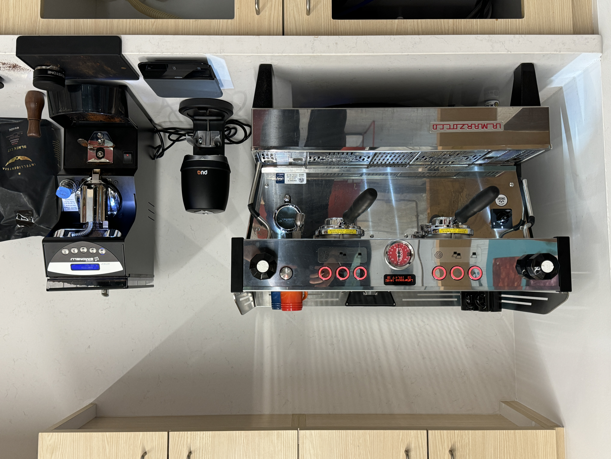

## Lounge

Outfitted with a beautiful La Marzocco Linea PB espresso machine, a Nuovo Simonelli Mythos grinder, and PuqPress automatic tamper, the Breakerspace Lounge is the source of the best espresso on campus.

### How to make an espresso

Please watch this [quick video](https://www.youtube.com/watch?v=5IZvKWzsl3I) to learn the easiest version of our espresso workflow. If you're interested in getting more in depth, ask!

### Request lounge access

The Breakerspace Lounge, is open to all MIT undergraduates from 8 AM to midnight, daily. In order to gain tap access to the lab, please fill out [this form](https://forms.gle/1pd59bjGXiPnehDL9). Tap access is usually granted within two business days. 
