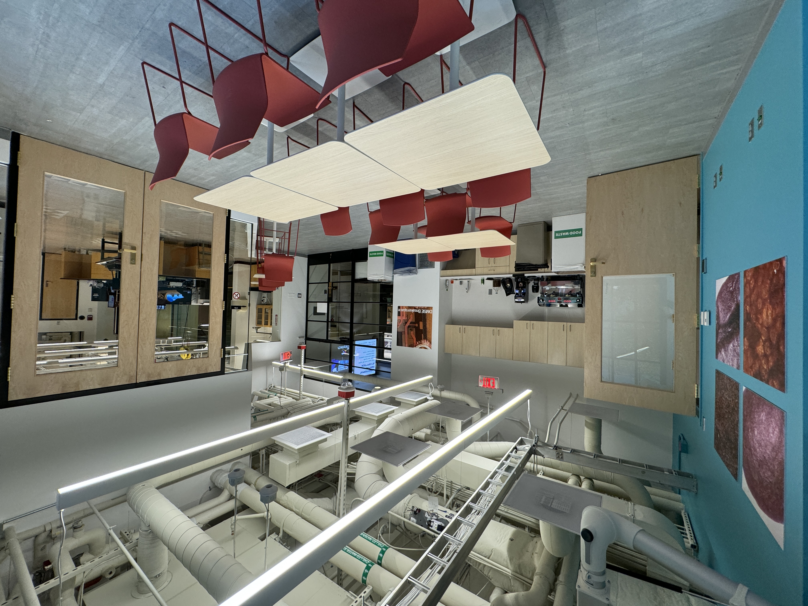

## Lounge

Outfitted with a beautiful La Marzocco Linea PB espresso machine, a Nuovo Simonelli Mythos grinder, and PuqPress automatic tamper, the Breakerspace Lounge is the source of the best espresso on campus.

The Breakerspace Lounge, is open to all MIT undergraduates from 8 AM to midnight, daily. In order to gain tap access to the lab, please fill out this form. Tap access is usually granted within two business days. 

<iframe src="https://docs.google.com/forms/d/e/1FAIpQLSdcX0J_sUQmiO0j15IHSrni4rX7LMLaILCjoXQOn4QriWAoHA/viewform?embedded=true" width="640" height="2165" frameborder="0" marginheight="0" marginwidth="0">Loading…</iframe>

### How to make an espresso

<iframe width="560" height="315" src="https://www.youtube.com/embed/5IZvKWzsl3I?si=g9ejfAcK7ElfVtX4" title="YouTube video player" frameborder="0" allow="accelerometer; autoplay; clipboard-write; encrypted-media; gyroscope; picture-in-picture; web-share" allowfullscreen></iframe>

Please watch this quick video to learn the easiest version of our espresso workflow. If you're interested in getting more in depth, ask!