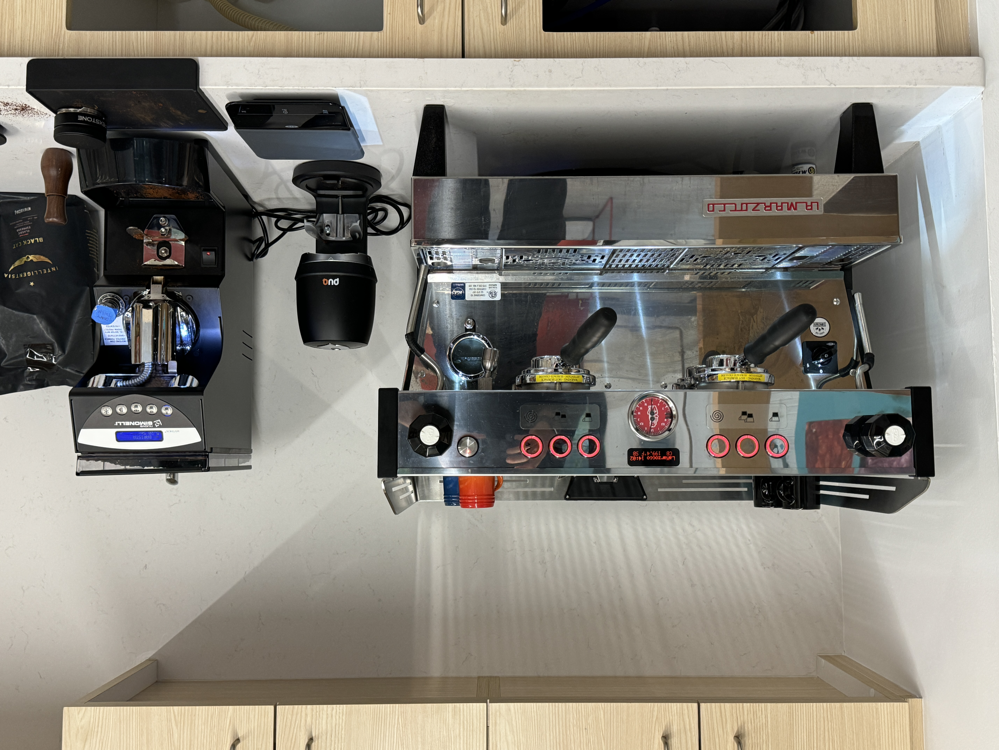
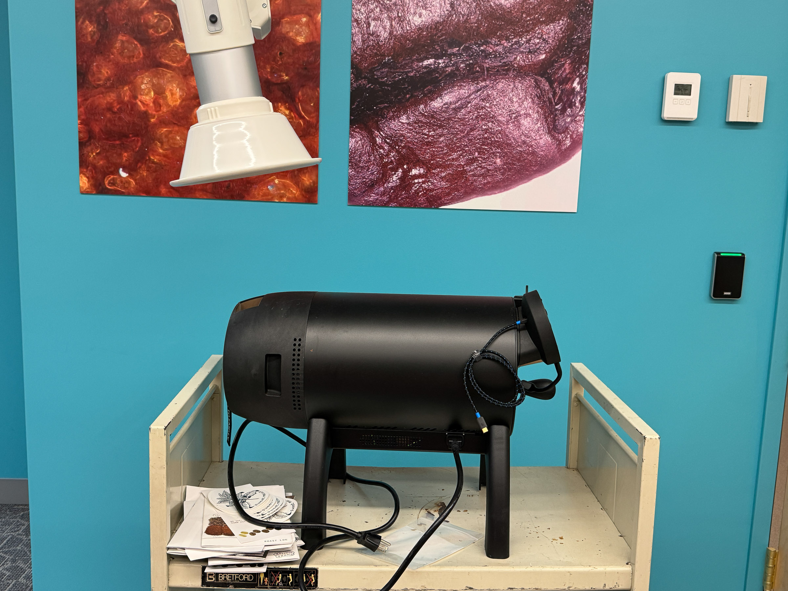
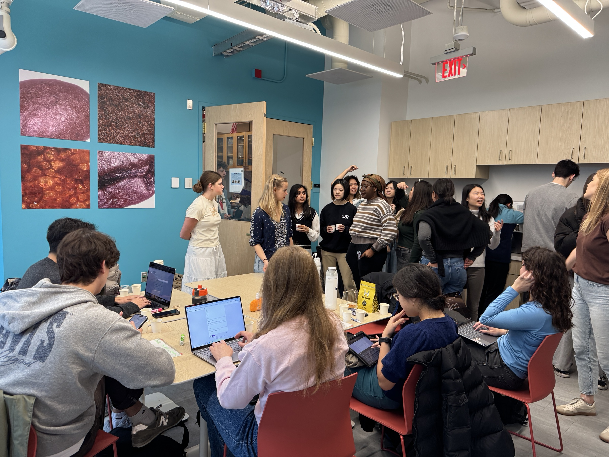

# Use The Breakerspace Lounge

Work, meet, take a break, or make coffee in the Breakerspace Lounge, just outside the instrument lab.

## Access {#hours-and-access}

All MIT undergraduates can [**request lounge access**](https://forms.gle/1pd59bjGXiPnehDL9). Complete the form and agree to the lounge policies.

Tap access is usually granted within two business days. Once your tap access is active, you can use the lounge **{{ site.data.lab.hours_description }}**.

For access problems, email [dmse-breakerspace@mit.edu](mailto:dmse-breakerspace@mit.edu).

## Using The Shared Space

### Food And Drink

Food and drink are welcome in the lounge. Keep them, cups, bottles, and eating utensils out of the instrument lab.

### Shared-Space Expectations

* Clear your table, dispose of waste, and wipe up spills before leaving.
* Leave furniture and equipment ready for the next person.
* Keep the path from the lab doors through the lounge to the corridor unobstructed.
* Be considerate of others working nearby.

## Coffee Equipment And Roasting

Once you have lounge access, you may use the espresso equipment. Bring your own mug, follow the posted instructions, and leave the equipment and counter clean. Ask staff before using unfamiliar equipment.

The lounge has a La Marzocco Linea PB espresso machine, Nuova Simonelli Mythos grinder, and PuqPress automatic tamper.

The Breakerspace also uses an Aillio Bullet R1 V2 roaster for coffee activities and instruction. Contact [dmse-breakerspace@mit.edu](mailto:dmse-breakerspace@mit.edu) to ask about current roasting activities and how to participate.

  <figure class="page-figure">
    
    <figcaption>Current espresso equipment in the Breakerspace Lounge.</figcaption>
  </figure>
  <figure class="page-figure">
    
    <figcaption>The Aillio Bullet roaster used for coffee activities and instruction.</figcaption>
  </figure>

## Learning And Community Events

The lounge can support teaching and collaborative work alongside the instrument lab. [3.000 Coffee Matters]({{ "/3000.html" | relative_url }}) is one example: students move between coffee preparation, sensory observation, materials characterization, and data interpretation.

<figure class="page-figure">
  
  <figcaption>Students gather in the lounge for a coffee brewing competition in 3.000 Coffee Matters.</figcaption>
</figure>

The lounge has also hosted occasional staff-organized community events. During Infinite Halloween, participants carve small pumpkins in the lounge before staff-guided compression testing on the [Instron]({{ "/tutorials/instron.html" | relative_url }}).

  <figure class="page-figure">
    
    <figcaption>Students carve pumpkins in the lounge during an Infinite Halloween trick-or-treating event.</figcaption>
  </figure>
  <figure class="page-figure">
    
    <figcaption>The event connects a lounge activity with staff-guided mechanical testing in the lab.</figcaption>
  </figure>

