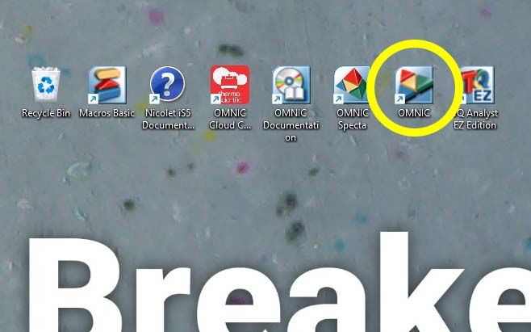
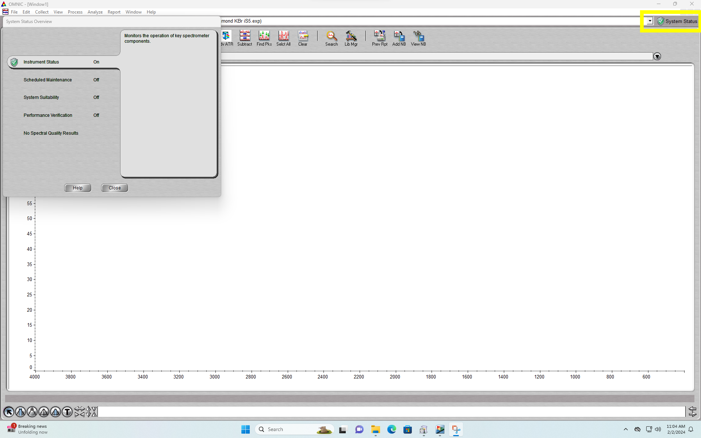

# Breakerspace FTIR Tutorial

## Sections:

* [Overview](#overview)
* [Workflow](#workflow)
* [Compatible materials and safety](#materials)
* [Background collection](#background)
* [Sample preparation and loading](#sample-prep)
* [Data processing and analysis](#analysis)
* [Manuals](#manuals)
* [Exercise](#exercise)

###  Overview:

The Nicolet iS5 FTIR Spectrometer Fourier-transform infrared (FTIR) spectrometer provides an infrared spectrum of absorption or transmission of a solid, liquid, or gas, for identification, primarily, of organic or polymeric materials. This tutorial focuses primarily on use of the instrument with an attenuated total reflectance (ATR) accessory, which allows for easy sampling of materials in solid, semi-solid, powder, paste, and liquid forms. 

###  Workflow steps:

#### Instrument startup

* Power on instrument, if needed
* Log on to instrument workstation using your MIT Kerberos
* Start OMNIC software
* Verify instrument connection via system status

<figure>
  
  
  
  
  <figcaption> Power indicator light, Power switch, OMNIC Icon, Instrument status indicator </figcaption>
</figure>

####  Prepare for collection:

Initially, and periodically as required:
* Remove protective cover from ATR crystal plate
* Clean ATR window
* Collect background (background will need to be refreshed periodically, the interval between background collections is configurable in software options)
* Clean ATR window

#### Sample collection

For each sample:
* Collect sample
* Clean ATR window
* Save sample spectrum
* Repeat as needed

#### Instrument shut down:

* Save all data (each spectrum must be indvidually selected and saved)
* Close OMNIC
* Log off workstation
* Clean ATR window
* Put cover on crystal plate and clamp in place using pressure tower
* Do not switch off (the manufacturer recommends leaving the instrument powered when not in use)

#### Cleaning the ATR crystal

* apply a few drops of isopropyl alcohol to the crystal
* wipe with Kimwipe

_insert gif of process_

### Workflow step instructions

####  Background collection:

Before collecting spectra, it is necessary to collect a background reading. The OMNIC software will automatically subtract the background from your sample spectrum, so it makes sense to collect a background that is relevant to your particular sample. If you are characterizing a solid or powder, the normal background will be air. If you are measuring an aqueous sample, and want to have water subtracted, you would collect a background of deionized water. If a sample is attached to a substrate such as a glass slide, you would collect the background on a clean section of the substrate. 

* Load the background material onto the ATR crystal, or for air leave it uncovered
* Click "collect background"

_insert image with collect background highlighted_

####  Sample preparation and loading:

To maximize signal strength, it is important that the sample is in good contact with the entire ATR window. 

##### Solid samples

* Select self leveling pressure tip
* Solid samples should be smooth and free of contaminants on the face to be tested
* Cover the diamond window with the sample
* Position the pressure tower over the window
* Tighten the turn the knob until the clutch slips to provide clamping pressure to the sample 
* Click "collect sample" in OMNIC , clean, repeat as needed

Although many solid samples will not contaminate the window, it is still a good idea to wipe the window with isopropyl alcohol and a Kimwipe between samples.

<figure>
  
  <figcaption> Loading a solid sample</figcaption>
</figure>

##### Powder samples

It is especially important that powders contact the surface of the diamond window as completely as possible, so it is helpful that they are ground as finely as possible. Plan to run powder samples multiple times to verify you are getting a good signal.

* Select the concave pressure tip
* Position the pressure tower over the window
* Tighten the turn the knob until the clutch slips
* Click "collect sample" in OMNIC, clean, repeat as needed

_insert powder samples gif_

##### Liquid samples

* Place droplet of sample on ATR crystal
  * Non-volatile liquids can be run uncovered, without the use of the pressure tower
  * Volatile samples can be covered with the volatiles cover to prevent evaporation. Clamp volatiles cover the pressure tower
* Click "collect sample" in OMNIC, clean, repeat as needed

<figure>
  
  <figcaption> Use of the volatile cover </figcaption>
</figure>

##### Swapping pressure tip

<figure>
  
  <figcaption> Swapping pressure tips</figcaption>
</figure>

###  Compatible materials:

* Any non-hazardous solid, semi-solid, powder, paste, and liquid materials
* Solvents needed to clean a sample off the instrument must also be non-hazardous 

_**If you have any questions about whether a material is appropriate to characterize in the Breakerspace, please ask before bringing it to the lab.**_

###  Data processing and analysis:

Data processing is beyond the scope of this tutorial, but we recommend the use of the [Wiley KnowItAll Spectroscopy Software & Libraries available through the MIT Libraries](https://libguides.mit.edu/knowitall).

###  Manuals:

* [iS5 spectrometer user guide](https://www.dropbox.com/scl/fi/rfba0x3swuhi4affsytv6/2638_iS5-UG.pdf?rlkey=mnjpwg72rbau8dsaw8jwg9flk&dl=0)
* [iD7 ATR User Guide](https://www.dropbox.com/scl/fi/j24msyzbfpqahhk66z5y8/3021_-iD7_UG.pdf?rlkey=xf1sw5yoydqomsmcs1hxhrf5y&dl=0)
* [OMNIC software _Getting Started_ guide](https://www.dropbox.com/scl/fi/nhx1fk2ov5fpkz4og1guf/2640_OMNIC_GS.pdf?rlkey=93wld38wdscvv94o177jylilu&dl=0)
* [Complete set of manufacturer's manuals](https://www.dropbox.com/scl/fo/n0zv4090ncohz1yd53zyp/AEk8_3vo2JuCcHDSDBEEjck?rlkey=haqbguq12kbmh8fi7jmi8wzvg&dl=0)

###  Exercise:

Test solid polymer samples and determine which is acrylic and which is polypropylene through a library search. Measure samples of caffeinated and decaffeinated ground coffee and determine which is which by comparing the height of the peak at 1650.

