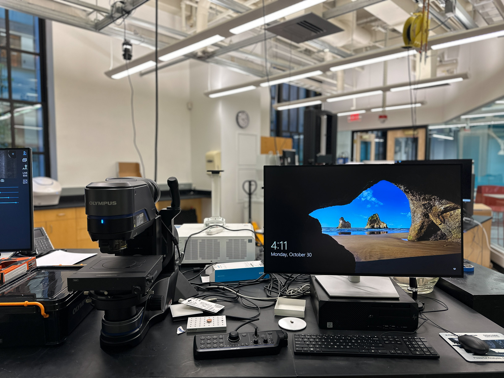

# Breakerspace Optical Microscope Tutorial

## Overview:

The Olympus DSX1000 Digital Microscope is a powerful instrument that allows you to see images in full color at high magnifications, capture 3D data, and stitch together large images with six observation modes.

### Index:

* [Standard operating protocol](#sop) - ([startup](#startup), [operation](#operation),[features](#features), [shutdown](#shutdown))
* [Materials and sample prep](#materials)
* [Detailed operating instructions](#details)
* [Data processing and analysis](#data)
* [Common failure modes](#failures)
* [Manufacturer manuals](#manuals)
* [Links](#links)
* [Exercises](#exercises)

### Standard operating protocol:

 
#### Instrument startup:

* [Switch](../assets/img/tutorials/optical/switch.JPG) the microscope [on](../assets/img/tutorials/optical/status-on.JPG)
* Log on to instrument workstation using your MIT Kerberos
* Clear the [stage](../assets/img/tutorials/optical/stage.JPG) of any samples or other materials
* Start the [DSX Software](../assets/img/tutorials/optical/desktop.PNG) and [log on as Guest](../assets/img/tutorials/optical/guest.PNG) (no password)
* [Acknowledge it is safe for the stage and head to move](../assets/img/tutorials/optical/acknowledge.PNG)
* Use the manual focusing knob to [lower the microscope stage](../assets/img/tutorials/optical/lower.GIF)
* Load/change [objectives](#objectives) if needed
* Lower the microscope head into the _tilt position_ using [the button on the console](../assets/img/tutorials/optical/tilt-console.JPG) or the [software button](../assets/img/tutorials/optical/tilt-software.JPG)

#### Operation: 

* [Put your sample on stage](#sample-prep)
* Use the [manual focusing knob](../assets/img/tutorials/optical/focus.GIF) to bring sample into focus
* With the [joystick move stage](../assets/img/tutorials/optical/joystick.GIF) back/forth and left/right to position desired sample area under observation
* Fine-tune focus by moving the zoom head with the console buttons/[wheel](../assets/img/tutorials/optical/focus-wheel.GIF) or software buttons
* Select observation mode by clicking the best image button, select all modes, select desired image, and click apply ([see manual page 63](https://www.dropbox.com/scl/fi/bmfph79975i1p0wv4pbuf/DSX1000-Application-M-E.pdf?rlkey=fzmbq39hr926gpbbtgft9fxxt&dl=0))
* Characterize! For a list of features see the [detailed operating instructions](#details)
* Verify files are saved where you intend
* Repeat as needed

#### Instrument shut down: 

* Close the DSX software
* Click [yes](../assets/img/tutorials/optical/exit.GIF) to exit the microscope system and retract the head
* [Switch](../assets/img/tutorials/optical/switch.JPG) the microscope [off](../assets/img/tutorials/optical/status-off.JPG)
* Log out of Windows
* Place the [dust cover](../assets/img/tutorials/optical/cover.JPG) over the microscope

 
### Compatible materials and sample prep: 

* Materials should be non-hazardous and safe to handle in the Breakerspace
* Any liquids should be contained so they do not spill on the stage
* Loading capacity of the stage is 5 kg

 
#### Sample Prep:

The instrument has no particular sample prep requirements. As long as a sample is non-hazardous and safe to handle, weighs less than 5 kg, is not so tall as to prevent achieving focus, and can be place under observation without contaminating the microscope (ie spilling), it is possible to observe on the microscope. However, additional care in sample preparation may improve imaging results, depending on sample type and characterization goals. 

 
### Detailed operating instructions:

#### Features:

* Quick preview of and switching between six observation modes (brightfield, oblique, darkfield, brightfield/darkfield mix, simple polarization, and differential interference contrast)
* Capture 2D and 3D images
* Automated capture and stitching of images in 2D or 3D mode to show larger regions
* Tilt the microscope head to observe your sample from different angles
* Rotatable stage
* Many post-processing and analysis tools to annotate images with dimensions, calculate surface roughness, export 3d mesh data, etc.

#### Objectives:

* Long working distance: 5x (cannot be used in polarized observation mode), 10x, 20x, 40x 
* Extra long working distance: 1x, 5x, 10x __double check these!!__
* Instructions to replace objective unit are on page 11 of the [Quick Reference Guide](https://www.dropbox.com/scl/fi/npmn40ndidrc329ev1eze/DSX1000_QRG_EN_AX9342_03.pdf?rlkey=qwg423vnbo5o3811uyjbzhmlh&dl=0)

There is an internal optical zoom system that boosts magnification from 14-140x, so total magnification will be (external objective) * (internal zoom factor), for a range of about 14x to 5600x depending on configuration used.

#### Observation modes:

Many different observation modes are available and can be selected in the desktop application or on the console:

* Brightfield (BF) - recommended for observing flat samples
* Oblique - similar to the BF observation, recommended for emphasizing the scratches or unevenness
* Darkfield (DF) - recommended for finding edges, dust, or scratches, or for observing color that is difficult to observe in BF observation
* Brightfield/darkfield mix - combines easy visibility in BF observation and high detectability in DF observation, recommended for searching scratches or defects that are difficult to find
* Simple polarization - recommended for finding the best image of the sample, e.g., crystals of rocks or minerals, etc.
* Differential interference contrast (DIC) - recommended for observing fine unevenness (wave) that cannot be found with other observation methods

The _Best Image_ feature gives a quick preview of how the sample looks in each observation mode, and allows quick selection of the preferred mode. The [DSX1000 Digital Microscope Operation Manual](https://www.dropbox.com/scl/fi/bmfph79975i1p0wv4pbuf/DSX1000-Application-M-E.pdf?rlkey=fzmbq39hr926gpbbtgft9fxxt&dl=0) offers detailed instructions on use of the _Best Image_ feature on page 52, and detailed explanations of each observation mode starting on page 63.

<figure>
  
</figure>

#### Acquisition

In this program, 2-D acquisition captures a photo of the sample. A 3-D acquisition will take images across a range of focuses to create a 3-D render of the sample. These 3-D renders can be used to measure the sample. To create a 3-D aquisition navigate to the “Live” section of the program. In the bottom right corner of the screen, there will be a large gray button labeled either 2-D or 3-D Acquisition. Above this button, there will be options for 2-D, Quick Scan, Range, and Start/End. 

##### 2-D

2-D acquisition takes a photo of whatever is currently on the live display. This photo cannot be used to create a 3-D render of the sample.

##### 3-D

Quick Scan, Range, and Start/End are the three modes of 3-D acquisition and all three follow a similar process. For each of them you will set a range and the objective will shift the focus upwards towards the lens according to that range. For each of them you will start by focusing the objective on the part of the sample farthest away from the lens.

###### Quick Scan

Quick scan is the quickest and simplest to execute of the three modes, but also the least precise. To execute a quick scan, focus the microscope on the part of the sample farthest away from the lens and click 3-D Acquisition. The lens will zoom out automatically and prepare a 3-D render.

<figure>
  
</figure>

###### Range

This mode allows for more customization of the range of focal lengths that the lens moves through. Choose the range that suits the sample and focus the lens on the part of the sample farthest away from the lens. Click 3-D Acquisition and the lens will begin to focus on the parts of the sample closer to the lens. When it is finished, check the 3-D render and ensure that all of the sample is in focus. If a portion of the sample is not in focus, choose a different range and try again or use the Start/End mode.

<figure>
  
</figure>

###### Start/End

This is the most precise method of 3-D acquisition, but harder to execute. To begin, focus the lens on the part of the sample farthest from the lens and press start. Then, turn the wheel on the console the other way and focus closer than the closest part of the sample, and click end. Finally, click 3-D acquisition and a render will be created.

<figure>
  
</figure>

##### Stitching

The Stitch feature allows for the creation of a 3-D acquisition over a large area. This is done by creating a low quality map of the area you would like to render, and then selecting the area on the map you would like to make a higher quality acquisition. The microscope will take multiple 3-D acquisitions of the sample and then combine them into one larger model of the sample.

To create the map, select stitching mode and select live panorama. In the box labeled acquisition, click 2-D simple. In the box labeled 2D simple settings, select auto, then change the size of the array to suit the size of your sample. Make sure that “Use it as a map image” is selected, then click 2D simple. The resulting map can then be used to create a high quality panorama.

<figure>
  
</figure>

Go back to the stitching feature and select high quality panorama. In the menu that appears, select “number of pieces” in the top left. Adjust the dimensions to fit your sample and drag the yellow box on the map to the right. Adjust the autofocus (AF) settings as needed, and click 3-D acquisition. A message may appear that says the z-position is out of range. If this happens simply click OK and the program will proceed.

<figure>
  
</figure>

### Data processing and analysis 

The measurement feature allows the user to determine a variety of information about the sample. This includes the change in elevation, horizontal distance, and angle between two points or along a shape. The volume of the sample can be calculated, along with the volumes of any divots or troughs along the sample. To perform these measurements, click on the measurement tab next to imaging, and then click the measurement option located directly below the reports tab. To check the distance, change in elevation, or angle between two points, select the profile option. To make a wire frame model, click the button with the arrow pointing from 2D to 3D. To find the volume of a crest or trough, select the volume option.

<figure>
	 
	
</figure>

### Common failure modes

* If any part of your sample is resting on a part of the stage that cannot move, as you move the stage your sample will rotate on the stage.
* You will not be able to access the software if it is started before the microscope is turned on.

### Manufacturer's manuals 

* Links to manual files in dropbox

### Links

* list of links, ie. good video tutorials, some student project, anything relevant

### Exercises

* intro for anyone - eg honey bee on optical
* beginner exercise for course 3 subjects - identify and measure types of grain in metal sample, 
* advanced exercise - deconvolution of compound sample from spectrometer, etc.

