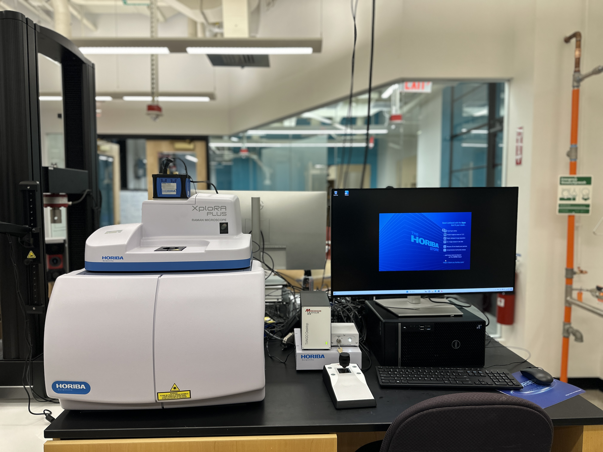
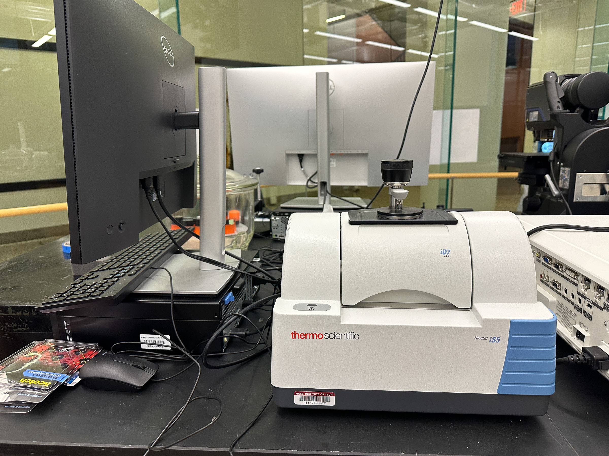
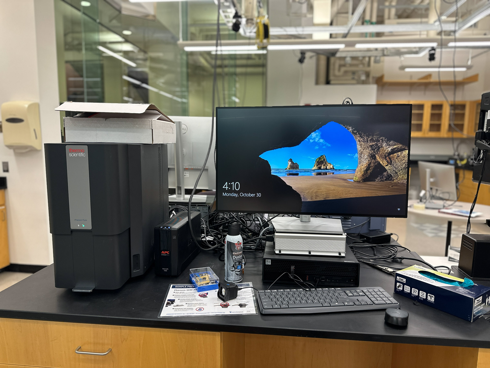

# Breakerspace Instrument Tutorial Template - \<h1>

## Overview - \<h2>

Matches info/image for instrument on lab page, brief description of what it does/how it works/what materials it's used for

### Index: - \<h3>

* [Standard operating protocol](#sop) - ([startup](#startup), [operation](#operation), [shutdown](#shutdown))
* [Materials and sample prep](#materials)
* [Detailed operating instructions](#details)
* [Data processing and analysis](#data)
* [Common failure modes](#failures)
* [Manufacturer manuals](#manuals)
* [Links](#links)
* [Exercises](#exercises)

### Standard operating protocol 

 

##### Instrument startup: - \<h5> 

* Turn on machine
* Start Software
* Lower stage
* Bring machine into tilt position

##### Operation: 

* Put sample on tray
* Use knob to bring sample into focus
* Use dial on console to focus with more precision
* Capture a 2D picture of the sample
* Make a 3D capture of the sample using start/end mode
* Use stitching feature to make a map of the sample
* Use the map to create a 2D of 3D capture of a large area of the sample based on the map image
* Use measurement tab to measure the distance, angle, or difference in height between two points on sample
* Use measurement tab to find the volume of the sample.

#####  Instrument shut down 

* Bring lens into lens exchange position
* Turn of machine
* Log out of software

 

### Compatible materials and sample prep: 

* compatible materials
* incompatible materials
* safety/handling related info
* images/videos inline as needed

##### Sample Prep may be own sub-section

* sample prep
	* break into sub-sections as relevant, 
	* ie. solid vs. powder vs. liquid

 

#### Detailed operating instructions

###### Lighting

Many different lighting modes can be adjusted in the desktop application or on the control panel. Every mode can be seen simultaneously by selecting the best image button. Some lenses are not suited for the PO or polarity mode. DF or dark field typically produces the highest quality results.

<figure>
  
</figure>

###### Acquisition

In this program, 2-D acquisition captures a photo of the sample. A 3-D acquisition will take images across a range of focuses to create a 3-D render of the sample. These 3-D renders can be used to measure the sample. To create a 3-D aquisition navigate to the “Live” section of the program. In the bottom right corner of the screen, there will be a large gray button labeled either 2-D or 3-D Acquisition. Above this button, there will be options for 2-D, Quick Scan, Range, and Start/End.

##### 2-D

2-D acquisition takes a photo of whatever is currently on the live display. This photo cannot be used to create a 3-D render of the sample.

##### Quick Scan

Quick scan is the quickest and simplest to execute of the three modes, but also the least precise. To execute a quick scan, focus the microscope on the part of the sample farthest away from the lens and click 3-D Acquisition. The lens will zoom out automatically and prepare a 3-D render.

<figure>
  
</figure>

##### Range

This mode allows for more customization of the range of focal lengths that the lens moves through. Choose the range that applies to the sample and focus the lens on the part of the sample farthest away from the lens. Click 3-D Acquisition and the lens will begin to focus on the parts of the sample closer to the lens. When it is finished, check the 3-D render and ensure that all of the sample has been rendered. If a portion of the sample is not rendered, choose a different range and try again or use the Start/End mode.

<figure>
  
</figure>

##### Start/End

This is the most precise method of 3-D acquisition, but harder to execute. To start, focus the lens on the part of the sample farthest from the lens and press start. Then, turn the wheel the other way and focus closer than the closest part of the sample, and click end. Finally, click 3-D acquisition and a render will be created.

<figure>
  
</figure>

##### Stitching

The Stitch feature allows for the creation of a 3-D acquisition over a large area. This is done by creating a low quality map of the area you would like to render, and then selecting the area on the map you would like to make a higher quality acquisition. The microscope will take multiple 3-D acquisitions of the sample and then combine them into one larger model of the sample.

To create the map, select stitching mode and select live panorama. In the box labeled acquisition, click 2-D simple. In the box labeled 2D simple settings, select auto, then change the size of the array to suit the size of your sample. Make sure that “Use it as a map image” is selected, then click 2D simple. The resulting map can then be used to create a high quality panorama.

<figure>
  
</figure>

Go back to the stitching feature and select high quality panorama. On the menu that appears select “number of pieces” in the top left. Adjust the dimensions to fit your sample and drag the yellow box on the map to the right. Adjust the autofocus (AF) settings as needed, and click 3-D acquisition. A message may appear that says the z-position is out of range. If this happens simply click OK and the program will proceed.

<figure>
  
</figure>

### Data processing and analysis 

The measurement feature allows the user to determine a variety of information about the sample. This includes the change in elevation, horizontal distance, and angle between two points or along a shape. The Volume of the sample can also be calculated as well as the volumes of divots or troughs along the sample. To perform these measurements, click on the measurement tab next to imaging, and then click the measurement option located directly below the reports tab. To check the distance, change in elevation, or angle between two points select the profile option. To find the volume of a crest or trough select the volume option.

<figure>
	 
	
</figure>

### Common failure modes

* If any part of your sample is resting on a part of the stage that cannot move, as you move the stage your sample will rotate on the stage.
* You will not be able to access the software if it is started before the microscope is turned on

### Manufacturer's manuals 

* Links to manual files in dropbox

### Links

* list of links, ie. good video tutorials, some student project, anything relevant

### Exercises

* intro for anyone - eg honey bee on optical
* beginner exercise for course 3 subjects - identify and measure types of grain in metal sample, 
* advanced exercise - deconvolution of compound sample from spectrometer, etc.

# HTML examples to control layout, etc.

Full width image , with caption, link to open image full screen:  

<figure>
	
	<figcaption> An AI generated image. </figcaption>
</figure>

32% width images using html image tags, one links to full screen:

<figure>
	 
	
	
	<figcaption> Raman microscope, FTIR spectrometer, and scanning electron microscope. </figcaption>
</figure>

An image that floats to the right of text:

 FLOAT RIGHT - Floating image with text. 

This tag is necessary to clear the float, or else all text below will keep floating next to image: \

  

Same thing with image that floats to the left of text:  

 FLOAT LEFT - Floating image with text. Floating image with text.Floating image with text.Floating image with text.Floating image with text.Floating image with text.Floating image with text.Floating image with text.Floating image with text.Floating image with text.Floating image with text.Floating image with text.Floating image with text.Floating image with text.Floating image with text.Floating image with text.Floating image with text.Floating image with text.  

  

A gif sized to 32% width, that autoplays, with link that opens it full size:

<figure>
  
  <figcaption> Loading a solid sample</figcaption>
</figure>
  
Embedded video with controls:

<video width="100%" controls>
  <source src="../assets/video/raman-display-flip.MOV" type="video/mp4">
Your browser does not support the video tag.
</video>

