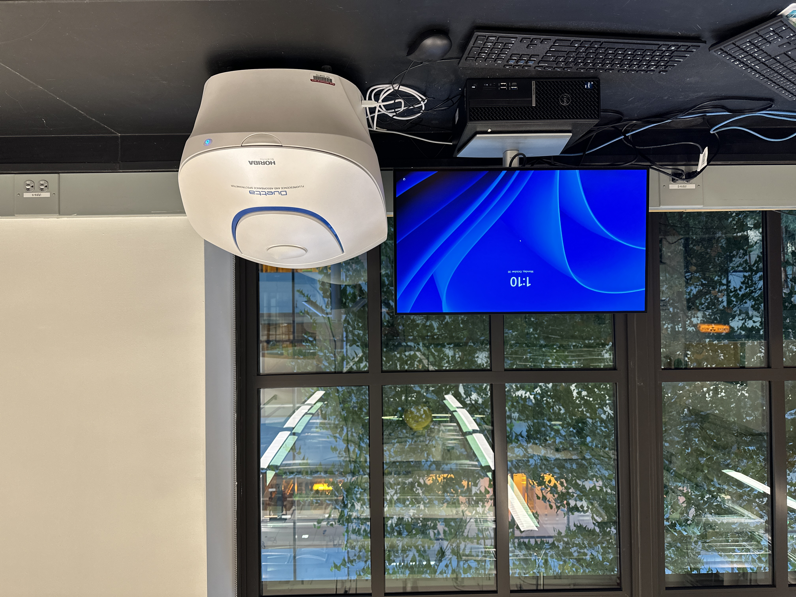
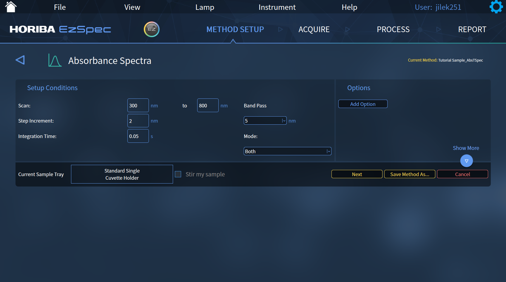
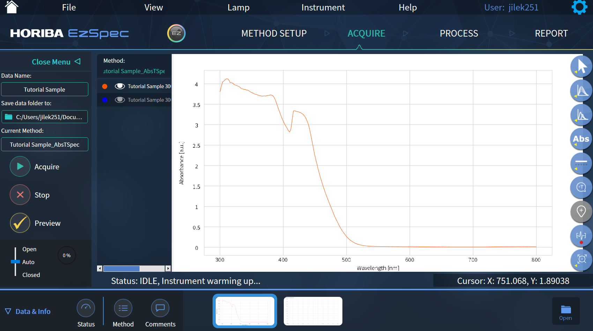
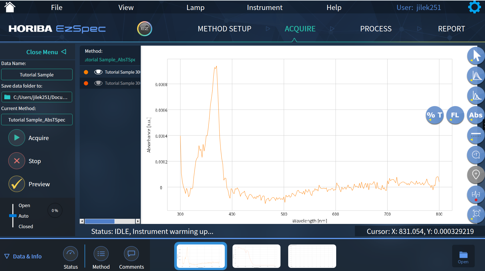

# Breakerspace UV-Vis Tutorial

## Overview

<figure>
      
</figure>

Duetta can be used as a fluorometer, as a UV-Vis-NIR spectrometer to measure absorbance, or as an instrument that measures true molecular fingerprints, which require the acquisition of fluorescence and absorbance, correcting for IFE in real time.

### Index: 

* [Standard operating protocol](#sop) - ([startup](#startup), [operation](#operation), [shutdown](#shutdown))
* [Data processing and analysis](#data)
* [Materials and sample prep](#materials)
* [Common failure modes](#failures)
* [Manufacturer manuals](#manuals)
* [Exercises](#exercises)

### Standard Operating Protocol:

#### Start Up
* Flip power switch and press power button. 
* Power button must be blue to operate
* Log on to the desktop with your kerberos
* Open the EzSpec software
* Click EzSpec button

<figure style="margin-left:0; margin-right:0;">
     
</figure>

#### Operation
* Click new method
* Click Absorbance and Transmission. There are other modes, but users are primarily focused on this mode.
* Click Spectra
* Make sure the setup conditions are adequate.
* Set mode to both

<figure>
    
    <figcaption>  </figcaption>
</figure>

* Fill the cuvet with your sample
* Name your sample and choose where you want it to save
* For best results, wait for the lamps to warm up
* Click Acquire
  
<figure>
    
    <figcaption>  </figcaption>
</figure>

* Load your sample by pressing down on the machine’s lid. Close the top.
* Load a sample of deionized water when the software instructs you to load a blank.

<figure style="margin-left:0; margin-right:0;">
     
    
</figure>

#### Data Analysis
* Under Acquire tab, you can toggle between Transmission, Absorbance, and Fluorescence.

<figure>
    
    <figcaption>  </figcaption>
</figure>

* Under the Process tab, you have the option of processing your data in many ways, including smoothing, finding peaks, fitting a curve, and more.
* Under Export tab, you can save your data as a text, as an EzSpec file, or generate a report.

#### Shut down
* Unload your sample
* __Push and hold power button until light shuts off.__ Shutting the machine down is important so that the lamp does not burn out.
* Log out of the desktop

### Materials
* Cuvettes are in bottom drawer under sample prep bench, labeled “Spare Cuvettes”
* Deionized water for dilution or blank samples is typically available in a squeeze bottom near the sink or the sample prep bench
* When filling the cuvette, do not get the outside of the cuvette dirty (by spilling contents on it or by touching it with your fingers). This results in worse data quality and possibly dirtying the machine

### Common failure modes
* If your sample is too concentrated, some peaks will be cut off. 

### Manufacturer manuals
* [Operation manual](https://www.dropbox.com/scl/fi/9bzwitjz004xd8pl5bpyl/Duetta-with-EZ-Spec-Operation-Manual-5700004252-Rev-1.4.3.pdf?rlkey=8ekvwddzdt0pk931zwpxov43l&st=yisoc2r2&dl=0)
  

### Exercises
* Intro: look at water with food coloring and identify on the spectrum the bumps or dips due to the color.
* Intro: Compare concentrations of a series of a samples
* Beginner: Identify the relative size of nanoparticles samples 
* Advanced: Deconvolution of compound sample
