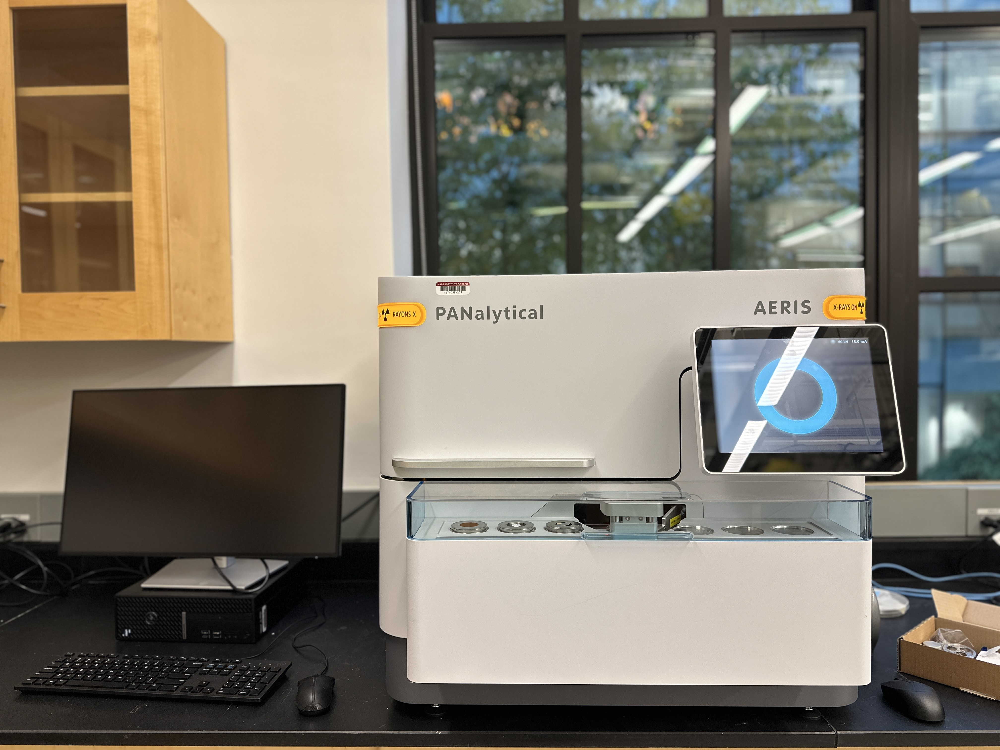

# Breakerspace XRD tutorial
## Overview:

<figure>
	  
</figure>

Use our [Panalytical Aeris Research XRD](https://www.malvernpanalytical.com/en/products/product-range/aeris-range) ([X-ray diffractometer](https://www.malvernpanalytical.com/en/products/technology/xray-analysis/x-ray-diffraction)) to analyze properties such as phase composition, crystal structure, and orientation of solid samples, with precise results in less than five minutes.

### Index: 

* [Standard operating protocol](#sop) - ([startup](#startup), [operation](#operation), [shutdown](#shutdown))
* [Materials and sample prep](#materials)
* [Detailed operating instructions](#details)
* [Data processing and analysis](#data)
* [Using HighScore Plus](#highscore)
* [Common failure modes](#failures)
* [Manufacturer manuals](#manuals)
* [Links](#links)
* [Exercises](#exercises)

### Standard operating protocol: 

 

##### Instrument startup:  

* Make sure at least one position in the sample changer is free (no sample holder in place)
* Turn the [mains power switch](../assets/img/tutorials/xrd/mains-switch.jpg) at the rear of the instrument
* Make sure that the cover is closed
* Press the [power button](../assets/img/tutorials/xrd/power-button.jpg) to switch on the instrument
* Turn the [HT keyswitch](../assets/img/tutorials/xrd/keyswitch.jpg) to switch on the HT generator

##### Operation: 

* Prepare your sample externally at the sample prep table
* Put the sample holder in a loading position on the sample changer
* Select a measurement program from the drop-down list
* Put in a descriptive sample name
* Start the measurement
* Export results to networked workstation or USB drive
* Fill out your information in the X-ray safety log book
* Repeat as needed - additional samples can be loaded and added to the queue while current sample is being measured

#####  Instrument shut down:

* Press the Power button to switch off the instrument
* Turn the HT Keyswitch counter-clockwise to switch off the HT generator
* If the instrument will be switched off for a long period of time, you can also switch off the mains power supply

 

### Compatible materials and sample prep: 

The Aeris has a Cu Kα x-ray generator with penetration on the order of 100 µm. For powder samples, grain size should be on the order of 5-10 µm to ensure sufficient grains of various compounds contribute to the reflection of the beam. This source will cause fluorescence in samples with iron and manganese, and may not provide suitable results for samples with those elements.
Panalytical provides an excellent sample preparation guide, available in paper form in the lab and here in [pdf form](https://www.dropbox.com/scl/fi/17o43bqhe52u49kkecvrf/xrd-sample-holders-preparation.pdf?rlkey=vxi65kwyeqrcr62jbcxa5rqvq&dl=0), please refer to it for instructions on use of the different types of sample holders and associated sample prep techniques.
Page 1.4 lists all the various types of sample holders that can be obtained. Of those, we have:
* PW1811/00 and PW1811/27 for back or front loading of powders
* PW1812/00 for odd shapes (fixed with plasticine or wax)
* PW1813/26 for metal plates, membrane filters, pressed pellets, etc.
XRD sample holders, mounting clay, and other small materials are stored in the black cabinet next to the sample prep table. Perform all sample loading steps at the table and transfer sample holders to the instrument on the tray once complete.

 

### Detailed operating instructions: 

##### Sample loading:
* Remove plastic sample case cover
* Place a prepared sample in any of the six positions on the sample changer
* Replace plastic sample changer cover

<figure style="margin-left:0; margin-right:0;">
	 
	
</figure>

##### Running a measurement program:
* Choose measurement program
* Enter sample ID
* Edit file name as necessary
* Click Add to Queue

<figure style="margin-left:0; margin-right:0;">
	 
	
</figure>

##### Exporting data:
Data can be saved on a USB drive, or exported to a shared network drive on the XRD workstation to the right of the instrument. The workstation can be accessed using a common login. The username is xrd and the password is xrd-password. Data can be found in the folder C:\XRD\XRD data

<figure style="margin-left:0; margin-right:0;">
	<a href="../assets/img/tutorials/xrd/xrd data in folder.png" target="_parent"> 
		<figcaption> Recommended export location in Windows explorer </figcaption>
</figure>

##### New measurement programs:
New measurement programs can be created using the software XRDMP Creator on the workstation that supports the XRD, though programs stored on the instrument should cover most basic analysis needs. Documentation on the use of XRDMP Creator is available in the XRDMP Creator Help menu. If you need to create new programs and need assistance, please contact Breakerspace staff.

##### Advanced mode:
Advanced mode is used to change optical components, manage data (including importing programs, and deleting programs and results), and other advanced configuration tools. Lab users typically will not need to access advanced mode, and instruction of its use is beyond the scope of this tutorial.

### Data processing and analysis:

* Data from the Aeris can be processed using [HighScore Plus 5.0](https://www.malvernpanalytical.com/en/products/category/software/x-ray-diffraction-software/highscore-with-plus-option)
  

#### Using High Score Plus:

##### Determine background:
* Treatment > Determine Background
* Automatic usually does the job.
* Granularity changes the distance between points of inflection on the background curve. 
* Bending factor determines how bendy the background is (as the name suggests). 
* Click Accept.

##### Determine peaks:
* Treatment > Search Peaks
* Play with the significance until the peaks reflect what you think are peaks. 
* Under Peak List, go through the peaks detected to make sure the software didn’t make any mistakes. Delete peaks by Right Click > Delete Peak. 
Insert peaks by 
  * Option 1: Treatment > Insert Peak (Ctrl+R). Click on the tip of each peak you want to add. 
  * Option 2: In Peak Lists > Right Click > Add Peak…  and manually enter the data. 

##### Determine a mystery compound:
* After determining the background and peaks,Right Click > Search Match > (Optional) change the search settings > Search > Ok.
* Options for improving your outcomes: 
  * Under the Restrictions tab > Restrictions set > Select Restriction set, you can pick your type of material from a drop down menu. For example, if you material is organic, select “Organic”
  * Under the Restrictions tab > Edit… will give you a pop up for many ways to restrict your search. For example, under Chemistry, one can input the elements that are or are not present in the sample. 
  * Clicking Execute Fitting > <Profile Fit> Default often improves the confidence and precision of the results. 
* Interpreting the Matches: 
  * Score shows the confidence of the program in the pattern match between your samples and the candidate. To check if the program was correct, click on the candidate you are interested in. Thin blue lines will show up on the graph. Check that each blue line matches up with the height and location of a peak of your sample. 
  * Once you are confident with your match, left click and pull it to the Pattern List panel. This “accepts” it. On the graph, if any peak is not matched by the accepted candidate’s pattern, it will retain a blue downward facing arrow on it. The candidates list reorganizes to find a compound that fits the unfitted peak. 
  * Continue this process until all peaks have been matched and all compounds in your sample have been found.

### Common failure modes:
* Booting the instrument with all sample changer positions occupied will result in an [error](https://www.dropbox.com/scl/fi/4a0rnd149la2lyrvo0rll/XRD_please_remove_sample.jpg?rlkey=u5x63mlic9llbitkgpigh0xcw&st=126n38zb&dl=0). Remove one of the sample holders, so that there is a free spot.

### Manufacturer's manuals:
* [Aeris quick start guide](https://www.dropbox.com/scl/fi/gqd44xvmv9q5660bk5gs4/aeris_quickstart_guide.pdf?rlkey=zj5qv5ajbxf80865fnh939r5g&dl=0)
* [Aeris user guide](https://www.dropbox.com/s/sw476m00qq3c7jr/aeris_user_guide.pdf?dl=0)
* [Highscore Plus quickstart guide](https://www.dropbox.com/scl/fi/0vaijznxsfaa05xfqwxd2/highscore_plus_quickstart_guide.pdf?rlkey=kx900yxwi5dtxug5ng1do8tyv&dl=0)
* [Sample holders and sample prep guide](https://www.dropbox.com/scl/fi/17o43bqhe52u49kkecvrf/xrd-sample-holders-preparation.pdf?rlkey=vxi65kwyeqrcr62jbcxa5rqvq&dl=0)
* [XRD for the analyst](https://www.dropbox.com/scl/fi/0e8vioulematgbd1yluzb/x-ray_powder_diffraction.pdf?rlkey=eae3hs1ispi1fi7vruh8oq9az&dl=0)

### Links:
* [Tutorial videos by the IAMM Diffraction Facility](https://www.youtube.com/@IAMMDiffractionFacility)
* [Panalytical XRD YouTube playlist](https://www.youtube.com/watch?v=YujXF6NKORM&list=PL2wIBTZfZRjdxVJYhan7PHbz_hyStiGgH)
* [Panalytical Aeris videos](https://www.youtube.com/@MalvernPanalytical/search?query=aeris)

### Exercises:
* Beginner: Identify the mystery powder
* Intermediate: Distinguish amorphous and crystalline polymers
* Intermediate: Distinguish mineral forms of calcium carbonate, i.e. calcite and aragonite
* Advanced: Identify mystery powder and label each peak with the crystal plane it results from
